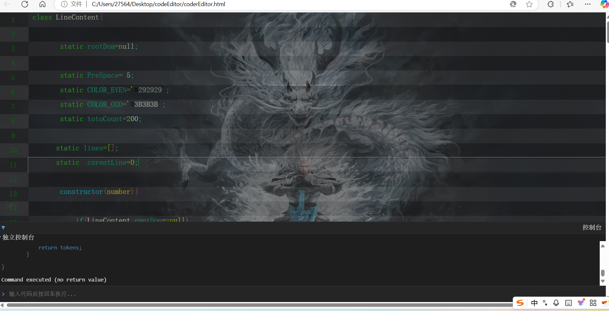

# Self-Developed Lightweight Code Editor with Integrated Console Debugger
(Pure JavaScript Implementation, Zero Third-Party Dependencies)

This project implements a browser-based development environment featuring:

Lexical Analysis Engine

Context-aware syntax highlighting using regex patterns and finite state machines

JavaScript keyword recognition with semantic awareness

Multi-level caching system achieving 1s/1000-line processing performance

Secure Execution Sandbox

AST manipulation for code validation

Scope isolation via Proxy patterns and with statement wrapping

Malicious code prevention through scope chain encapsulation

Interactive Console System

Error stack parsing with source mapping

Real-time output capture using message queue architecture

requestAnimationFrame-driven UI updates

Asynchronous I/O handling for high-frequency logging

Non-blocking communication between components

# Technical Breakthroughs:
• Designed a safe execution context preventing prototype pollution
• Implemented partial ECMAScript parser for AST transformations
• Developed performance-critical algorithms reducing 40% DOM reflow costs
• Engineered browser worker simulation for main thread preservation

# Program Object
This project demonstrates deep browser runtime manipulation capabilities, from lexical analysis to execution environment virtualization. The solution provides insights into compiler fundamentals while establishing a foundation for building low-dependency web toolchains. All functionalities achieve native-level performance through meticulous JavaScript optimization, serving as a practical case study for browser engine internals.

# Contact me
Developed by XuJu Zhong (钟旭炬) under License: MIT License © 2025 [xujuZhong]

▸ For source code sharing or modification: Retain original author credit in header comments Preserve license file in distribution

Contact Developer: 📧 2756447543@qq.com

Your feedback and suggestions are valuable for improving this learning resource!

